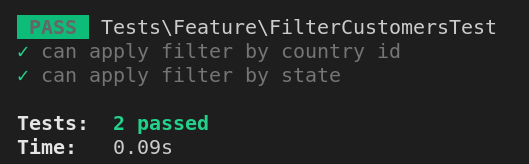
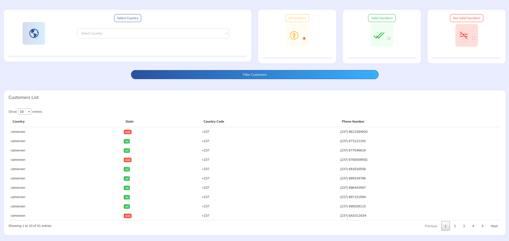
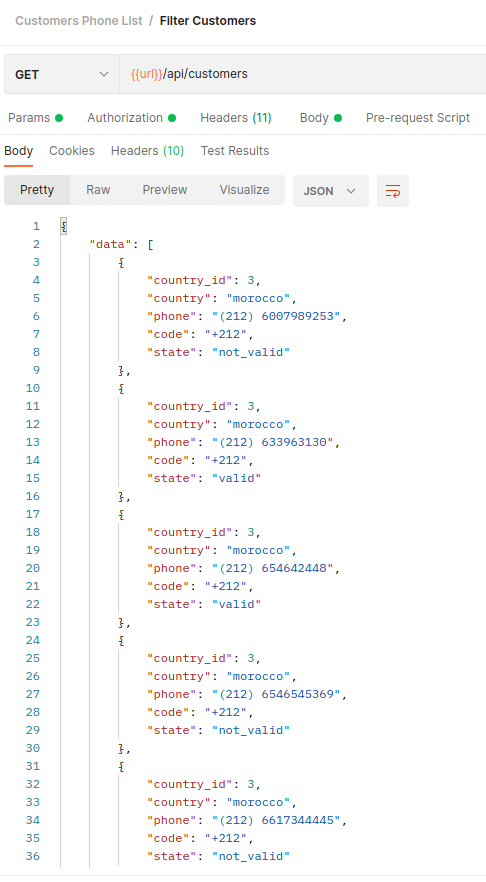

# Customers Phone List 

```
  1. Laravel application shows customers phone numbers list.
  2. Filtering phone numbers per country using country code.
  3. Check the validation of these phone numbers.  
```
## Requirement
```
  1. [Laravel 8.x](https://laravel.com/docs/8.x)
  2. [PHP >= ^8.0] (http://php.net/downloads.php)
  3. [Composer](https://getcomposer.org/)  
```

## Installation
1. Clone the repo via this url 
  ```
    git clone https://github.com/FatmaSaad/customers-phone-list.git
  ```

2. Enter inside the folder
```
  cd customers-phone-list
```
3. Create a `.env` file by running the following command 
  ```
    cp .env.example .env
  ```
4. Install various packages and dependencies: 
  ```
    composer install
  ```
5. Generate an encryption key for the app:
  ```
    php artisan key:generate
  ```
6. Run migrations and seeds: 
  ```
    php artisan migrate --seed
  ```
7. Run Servers
  ```
    php artisan serve
  ```
8. Run test cases
    before running next commands please make sure fill all databse test variables which begin with DB_TEST_ in .env file.

  ```
    php artisan optimize:clear
    php artisan test

  ```    
  

### Finally, You Can Enjoy :relaxed:

 1. Now, open your web browser and got `http://localhost:8000` .
      
      
 2. Import the POSTMAN Collection(customers-phone-list.postman_collection.json).
      


### Docs & Help

- [Laravel 8.x Documentation](https://laravel.com/docs/8.x)
